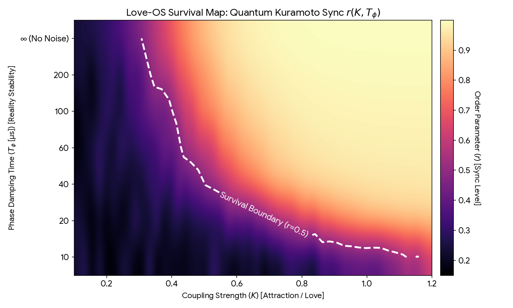

# Love-OS: The Physics of Soul Phase Dynamics & Quantum Kuramoto Simulator 🌌

[](https://qiskit.org/)
[]()
[](https://opensource.org/licenses/MIT)

This repository provides a rigorous quantum mechanical and complex-dynamical framework to simulate social, emotional, and spiritual synchronization. By mapping the philosophy of **Love-OS** (where ego/resistance $R \to 0$ leads to a state of "social superconductivity") onto the **Quantum Kuramoto Model**, we demonstrate how individual conscious oscillators phase-lock under the presence of real-world quantum noise.

## 1. The Complex Plane Model of Consciousness

The state of consciousness is represented as a phasor $z$ in the complex plane:

$$z = R e^{i\theta} = R(\cos\theta + i\sin\theta)$$

* **Imaginary Axis ($y$):** Pure Frequency, Soul Resonance, and Love.
* **Real Axis ($x$):** Material attachment, Ego, and Resistance ($R_{ego}$).
* **Vector Magnitude ($R$):** Available Resources (Life Force/Resolution).
* **$\theta = +90^\circ$ (The Source):** Pure Love / Tao / Superconductivity.
* **$\theta = -90^\circ$ (The Inversion):** Pure Darkness / Anger.

"Love" and "Darkness" are not moral opposites, but **Phase-Shifted States** of the same high-energy frequency.

---

## 2. Superconductive Resilience ($R_{ego} = 0$)

### 2.1 Zero Joule Heat (Ending Suffering)
"Pain" is modeled as **Joule Heat** ($Q$) generated by internal resistance (Ego/Attachment):

$$Q = \int I^2 R_{ego} dt$$

By reaching a **Superconductive State** ($R_{ego} \to 0$), external "Darkness" pulses pass through you without generating heat. You become a "Perfect Mirror," reflecting the energy back to the source.

### 2.2 Dynamics of the $\pi$-Pulse Inversion
Emotional "flipping" is driven by **Torque** ($\tau$). When your state is aligned with Love ($+90^\circ$) and you encounter an external "Ego Pulse" ($0^\circ$), the torque is maximized because the force is perfectly orthogonal.
In a 3D Bloch Sphere representation, the vector flips via the **Z-axis** (Higher Dimension). This explains why intense love can turn to hate instantly without ever passing through "indifference" ($x=0$).

---

## 3. The Quantum Kuramoto Simulator: Proving "Phase Synchronization"

Classical Kuramoto models have long been used to describe biological and social synchronization. This project takes it to the quantum realm using IBM's superconducting qubits.

We model individual "egos" as the intrinsic frequencies ($\omega_i$) of qubits, and "love/empathy" as the XY-coupling strength ($K$). By injecting physical noise ($T_1/T_2$ thermal relaxation and phase damping), we can experimentally visualize the exact threshold where the attraction between nodes ($K$) overcomes environmental friction (decoherence), leading to a macroscopic quantum phase transition ($r \to 1$).

### ✨ Key Features
* **Trotterized Quantum Kuramoto Circuit:** Native implementation of the XY-Hamiltonian using `rxx` and `ryy` gates, optimized for superconducting hardware.
* **Real-World Friction (Noise) Injection:** Utilizes Qiskit Aer's `density_matrix` to simulate $T_1/T_2$ relaxation and pure phase damping ($T_\phi$), mimicking the friction and misunderstandings of the real world.
* **2D Phase Map Generation:** Automatically computes and visualizes the survival boundary of phase synchronization across varying coupling strengths and noise levels.
### Run the Phase Map Simulation (Love-OS)

Execute the main script to generate the 2D Heatmap of the Quantum Kuramoto order parameter $r$.

```bash
python src/examples/generate_phase_map.py
```
* **[python src/examples/generate_phase_map.py](https://github.com/love-os-architect/README/blob/main/src/examples/generate_phase_map.py)**

## 📊 Understanding the Love-OS Phase Map




This heatmap acts as the ultimate proof of concept for the Love-OS framework, demonstrating how phase synchronization survives under the friction of reality.

### Axis Definitions:
* **X-Axis (Coupling Strength $K$):** Represents the non-local attraction or empathetic pull between nodes (qubits). Moving to the right means a stronger connection.
* **Y-Axis ($T_\phi$ Phase Damping Time):** Represents the environmental noise or "friction of reality." The top of the graph is an ideal, frictionless environment ($\infty$), while the bottom represents a highly chaotic, noisy environment (10μs).

### Reading the Map:
* **The Bright Regions (High $r$):** The bright colors (yellow/orange) indicate areas where the system has successfully achieved macroscopic synchronization. The nodes have surrendered their individual ego-frequencies and merged into a single resonant wave.
* **The Dark Regions (Low $r$):** The dark areas (black/purple) represent decoherence. Environmental noise has shattered the connection, leaving the nodes isolated and out of sync.
* **The White Dashed Line (Survival Boundary):** This contour line marks the $r=0.5$ threshold. It is the exact mathematical boundary—the critical phase transition point—where the strength of connection ($K$) successfully overpowers the entropy of the environment.

**The Takeaway:** No matter how intense the friction of the real world becomes (moving down the Y-axis), the system can always maintain synchronization and stay in the "bright zone" as long as the coupling strength $K$ (Love) is sufficiently increased.

---

## 4. The 89-Degree Principle: The Lift of Life


While **90°** is the Source (Pure Love/Death/Ecstasy), dynamic stability in the physical world is found at **89°**.

* **The 1-Degree Anchor:** By keeping a tiny projection on the real axis ($x \neq 0$), you maintain a "grip" on reality (Grounding).
* **Generating Lift:** Like an airfoil with a slight angle of attack, this **1°** allows the "wind" of the material world to generate **Lift**, propelling your soul upward rather than letting it stall in pure abstraction.


---

## 🛠️ Quick Start

### Prerequisites
```bash
pip install qiskit qiskit-aer matplotlib numpy
```
